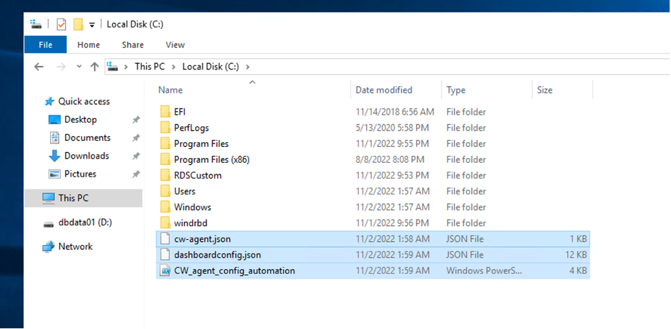
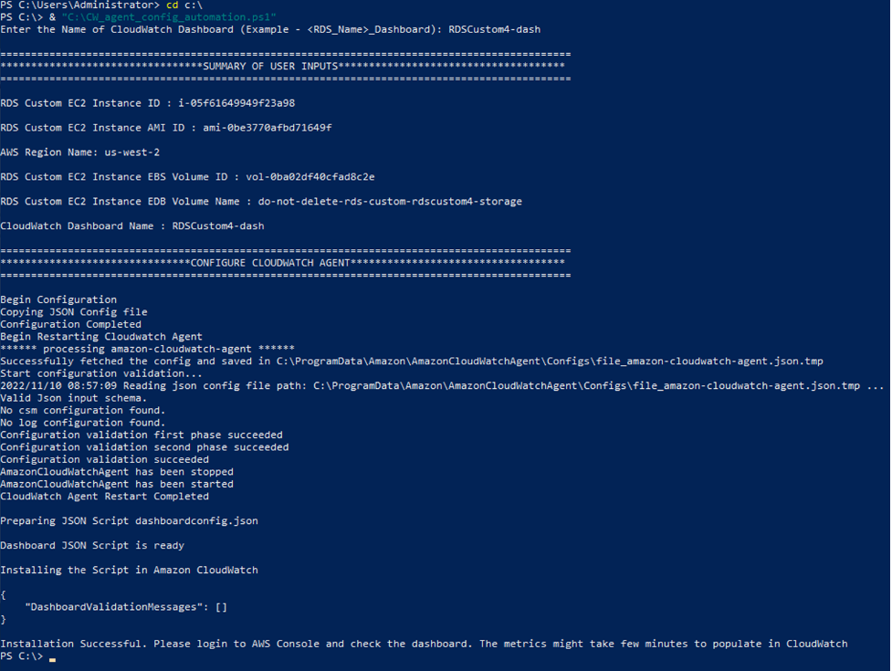
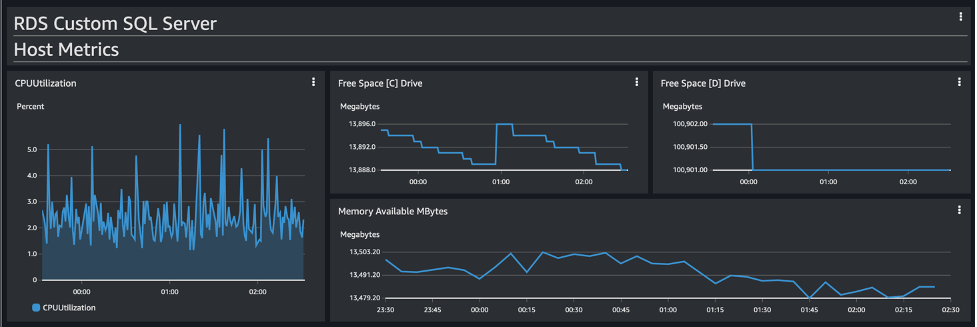
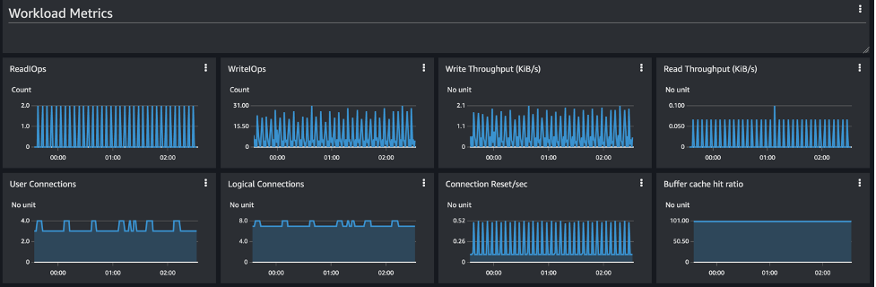
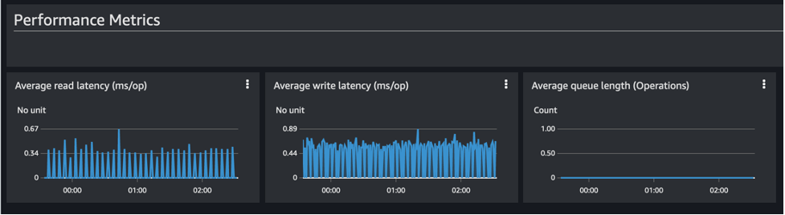

# SQL Server Monitoring Solution using Amazon CloudWatch

Monitoring is an important part of maintaining the reliability, availability, and performance of Amazon RDS Custom for SQL Server. In this post, we discuss how to use an [Amazon CloudWatch](http://aws.amazon.com/cloudwatch) dashboard to monitor Amazon RDS Custom for SQL Server, and how to use CloudWatch alarms for proactive monitoring. Additionally, we give a few example metrics-related alarms and demonstrate the setup process for improved monitoring capabilities. 

This monitoring solution can used for Self-Managed SQL Server installation on EC2 and RDS Custom for SQL Server environment. In both the cases, you have access to the underlying instances/servers.

In this post, we will integrate this tool with RDS Custom for SQL Server environment.

### Metrics collected by this method 

##### 1. Host Metrics 
| **Console   Name**        | **Description**                                               | **Units** |
|---------------------------|---------------------------------------------------------------|-----------|
| Free Space [D]   Drive    | The amount of   available storage space in the Data Volume.   | MB        |
| Free Space [C]   Drive    | The amount of   available storage space in the binary Volume  | MB        |
| CPUUtilization            | The percentage of CPU   utilization.                          | Percent   |
| Memory   Available Mbytes | The amount of   available random access memory.               | Mbytes    |

##### 2. Workload Metrics 
| **Console   Name**       | **Description**                                                                                                                                                                                                                        | **Units**    |
|--------------------------|----------------------------------------------------------------------------------------------------------------------------------------------------------------------------------------------------------------------------------------|--------------|
| Read IOPS                | The average number of   disk read I/O operations per second.                                                                                                                                                                           | Count/Second |
| Write IOPS               | The average number of   disk write I/O operations per second.                                                                                                                                                                          | Count/Second |
| Write   Throughput       | The average number of   bytes written to disk per second.                                                                                                                                                                              | Kib/s        |
| Read   Throughput        | The average number of   bytes read from disk per second.                                                                                                                                                                               | Kib/s        |
| User   Connections       | The number of client   network connections to the database instance via SQL Server Listener 1433   port.                                                                                                                               | Count        |
| Logical   Connections    | The  number of logical connections to the   system.                                                                                                                                                                                    | Count        |
| Connection   Reset/sec   | Total number of   logins started from the connection pool.                                                                                                                                                                             | Count        |
| Buffer Cache   Hit Ratio | Indicates   the percentage of pages found in the buffer cache without having to read from   disk. The ratio is the total number of cache hits divided by the total number   of cache lookups over the last few thousand page accesses. | Percent      |

##### 3.  Performance Metrics 
|  **Console   Name** |                                   **Description**                                  |   **Units**  |
|:-------------------:|:----------------------------------------------------------------------------------:|:------------:|
| Avg Read   Latency  | The average amount of   time taken per disk Read I/O operation.                    | Milliseconds |
| Avg Write   Latency | The average amount of   time taken per disk Write I/O operation.                   | Milliseconds |
| Avg Queue   Length  | The number of   outstanding I/Os (read/write requests) waiting to access the disk. | Count        |

### High-level implementation steps 
1. Set up an RDS Custom instance.
2. Assign AWS Identity and Access Management (IAM) permissions to the RDS instance role.
3. Connect to the RDS instance.
4. Automatic Installation of Tool
5. Manual Installation (Optional)
6. Run a load test to populate the metrics.
7. Create CloudWatch alarms for monitoring.

### Prerequisites 
To follow along with this post, you should have familiarity with the following AWS services:
- Amazon CloudWatch
- AWS Command Line Interface (AWS CLI)
- Amazon Elastic Compute Cloud (Amazon EC2)
- Amazon RDS Custom for SQL Server

### Assign IAM permissions to the RDS instance role

When you create an RDS instance, you attach an IAM role that dictates the services the instance can connect to. In order to have the agent publish metrics successfully, we need to provide the appropriate permissions to the IAM role attached to the RDS instance.
To do this, navigate to the IAM role attached to the RDS instance and add
the CloudWatchAgentServerPolicy policy. For instructions, refer to [Adding and removing IAM identity permissions](https://docs.aws.amazon.com/IAM/latest/UserGuide/access_policies_manage-attach-detach.html).
For more information about the IAM permissions required for the CloudWatch agent, refer to [Create IAM roles and users for use with the CloudWatch agent](https://docs.aws.amazon.com/AmazonCloudWatch/latest/monitoring/create-iam-roles-for-cloudwatch-agent.html).

### Automation Tool installation

1. Install AWS CLI on the underlying host (EC2 Instance) of your RDS Custom for SQL Server, you
can run this command on PowerShell to Install AWS CLI
"C:\> msiexec.exe /i https://awscli.amazonaws.com/AWSCLIV2.msi"
2. Ensure the IAM Role attached to the underlying host (EC2 Instance) of your RDS Custom for SQL Server, has the following permissions -  
- CloudWatch “put-dashboard” (This permission is required for the automation script to create the dashboard)  
- EC2 “describe-volumes” (This permission is required to get volume information for the automation script to create monitoring for the volumes)  
3. Verify if the IAM Role has the required permissions for the automation script to run successfully by running the below command on PowerShell -  
- aws ec2 describe-volumes
-  Get-EC2InstanceMetadata -Category InstanceId  
  
If both commands run successfully, we can confirm all permissions are setup correctly.

4. Download and copy the below files to C:\ drive on the RDS Custom EC2 Instance  

-   CW_agent_config_automation.ps1 : This script will automate the installation process. WE WILL WORK WITH THIS SCRIPT ONLY.
-   cw-agent.json : This script collects memory, TCP connections and other metrics from Performance Monitor to publish in the custom CloudWatch namespace.
-    dashboardconfig.json : This is the dashboard configuration file. It fetches raw data from the AWS/EC2 , AWS/EBS, and Custom namespaces and performs mathematical calculations to display CloudWatch metrics on the dashboard.
    

### Execute Automation
1. To execute the ps1 script, open PowerShell terminal as Administrator and run the following command

2. The script will prompt for CloudWatch dashboard name, provide a name and press enter.

3. The Automation will configure the CloudWatch Agent, Start the CloudWatch Agent and Create the RDS Custom dashboard. You can confirm the creation of the dashboard by using the AWS CloudWatch Console

### View the CloudWatch Metrics
Navigate to CloudWatch console and Click on Dashboard. This will show you the list of all dashboard.

## Contributors 
- Arnab Saha 
- Nanda Chinnappa 
- Sid Joshi

## Security

See [CONTRIBUTING](CONTRIBUTING.md#security-issue-notifications) for more information.

## License

This library is licensed under the MIT-0 License. See the LICENSE file.

